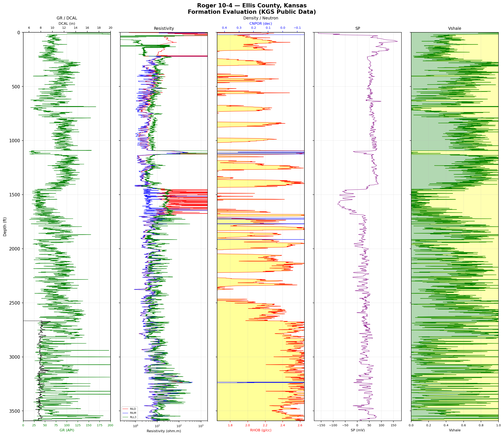

# Kansas Well Petrophysical Formation Evaluation
### Roger 10-4 - Ellis County, Kansas

## What I Built
I wrote a Python workflow from scratch that loads a real LAS file from a public 
Kansas oil & gas well, cleans and structures the raw log data, computes a 
petrophysical property (Vshale), and produces a professional 5-track formation 
evaluation display used in upstream reservoir characterization.

## Workflow
**1. Data Acquisition**  
Downloaded a real wireline log LAS file for the Roger 10-4 well from the Kansas 
Geological Survey (KGS) public database. This is an actual well drilled in 2008 
in Ellis County, Kansas with 3,629 ft of log coverage across 7,185 depth points.

**2. Data Loading & Cleaning**  
Used `lasio` - the industry-standard Python library for LAS files - to parse the 
file and load it into a pandas DataFrame. Dropped rows with missing values across 
key curves (GR, RHOB, CNPOR, RILD) to ensure clean analysis.

**3. Vshale Calculation**  
Computed Vshale using the GR Linear Index method:  
`Vshale = (GR - GR_min) / (GR_max - GR_min)`  
Used the 5th and 95th percentile of GR as clean sand and shale baselines - a more 
robust approach than hard-coded min/max values.

**4. 5-Track Formation Evaluation Display**  
Built a multi-track log display using matplotlib with:
- **Track 1 - GR + Caliper:** Lithology discrimination and borehole quality
- **Track 2 - Resistivity (RILD, RILM, RLL3):** Fluid typing on log scale
- **Track 3 - Density + Neutron:** Porosity and neutron-density crossover flagging
- **Track 4 - SP:** Spontaneous potential for permeability and fluid salinity
- **Track 5 - Vshale:** Sand/shale discrimination with green/yellow fill

## Key Findings
- Multiple clean sand intervals (Vshale < 0.3) identified between 500-1600 ft
- Neutron-density crossover zones indicate potential light fluid (gas/light oil) presence
- Resistivity highs correlate with clean Vshale zones confirming reservoir intervals
- SP deflections consistent with permeable sand intervals

## Formation Evaluation Plot

## Data Source
Kansas Geological Survey (KGS) — Public Domain  
Well: Roger 10-4 | API: 15-051-25836 | Ellis County, Kansas  
https://www.kgs.ku.edu/Magellan/Logs/

## Tools & Libraries
`Python` `lasio` `pandas` `numpy` `matplotlib`

## Author
**Tarun Joshi** | Petroleum Engineering M.Eng., Texas A&M University  
[LinkedIn](https://www.linkedin.com/in/tarunjoshi03) | 
[GitHub](https://github.com/tarunjoshi03)
