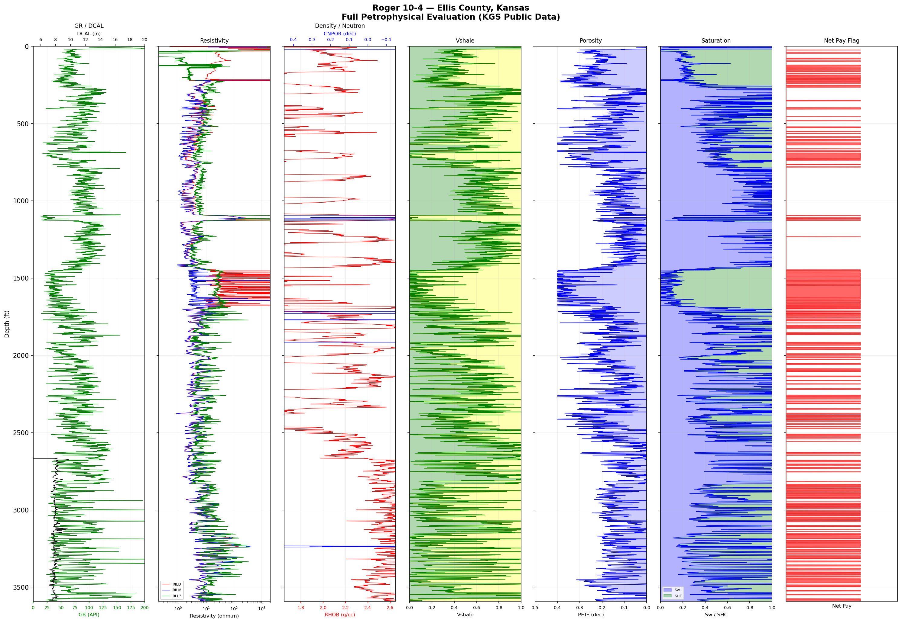

# Kansas Well Petrophysical Formation Evaluation
### Roger 10-4 - Ellis County, Kansas

## What I Built
A complete Python petrophysical evaluation workflow applied to a real LAS file 
from a public Kansas oil & gas well. Starting from raw wireline log data, I built 
a full reservoir characterization pipeline - from data loading and cleaning through 
porosity and water saturation calculations - culminating in a 7-track formation 
evaluation display and automated net pay flagging.

## Workflow

**1. Data Acquisition**  
Downloaded a real wireline log LAS file for the Roger 10-4 well from the Kansas 
Geological Survey (KGS) public database. Drilled in 2008 in Ellis County, Kansas 
with 3,629 ft of log coverage across 7,185 depth points.

**2. Data Loading & Cleaning**  
Used `lasio` - the industry-standard Python library for LAS files - to parse the 
file into a pandas DataFrame. Dropped rows with missing values across key curves 
(GR, RHOB, CNPOR, RILD) to ensure clean analysis.

**3. Vshale Calculation**  
Computed Vshale using the GR Linear Index method:  
`Vshale = (GR - GR_min) / (GR_max - GR_min)`  
Used P5 and P95 of GR as clean sand and shale baselines for robustness.

**4. Porosity Calculation (PHIE)**  
Calculated density porosity (PHID) from bulk density using:  
`PHID = (RHOMA - RHOB) / (RHOMA - RHOF)`  
Combined with neutron porosity (CNPOR) and corrected for shale volume to get 
effective porosity (PHIE). Mean PHIE in reservoir intervals: **25.7%**

**5. Water Saturation (Archie's Equation)**  
Computed water saturation using Archie's equation:  
`Sw = ((a × Rw) / (PHIE^m × Rt)) ^ (1/n)`  
Used a=1, m=2, n=2, Rw=0.05 ohm·m (typical Kansas saline aquifer).  
Mean Sw in clean sand intervals: **33.4%** → Mean hydrocarbon saturation: **66.6%**

**6. Net Pay Flagging**  
Automated net pay identification using three simultaneous cutoffs:  
- Vshale < 0.3 (clean sand)  
- PHIE > 0.1 (sufficient porosity)  
- Sw < 0.6 (sufficient hydrocarbon saturation)

**7. 7-Track Formation Evaluation Display**  
Built a professional multi-track log display using matplotlib:
- **Track 1 - GR + Caliper:** Lithology and borehole quality
- **Track 2 - Resistivity (RILD, RILM, RLL3):** Fluid typing on log scale
- **Track 3 - Density + Neutron:** Porosity and crossover flagging
- **Track 4 - Vshale:** Sand/shale discrimination
- **Track 5 - PHIE:** Effective porosity
- **Track 6 - Sw / SHC:** Water and hydrocarbon saturation
- **Track 7 - Net Pay Flag:** Intervals passing all three cutoffs simultaneously

## Key Results
- Multiple clean sand intervals identified between 500-1600 ft
- Mean effective porosity in reservoir: **25.7%**
- Mean hydrocarbon saturation in reservoir: **66.6%**
- Net pay flags concentrated in upper section (500-1100 ft)

## Full Petrophysical Evaluation

## Data Source
Kansas Geological Survey (KGS) - Public Domain  
Well: Roger 10-4 | API: 15-051-25836 | Ellis County, Kansas  
https://www.kgs.ku.edu/Magellan/Logs/

## Tools & Libraries
`Python` `lasio` `pandas` `numpy` `matplotlib`

## Author
**Tarun Joshi** | Petroleum Engineering M.Eng., Texas A&M University  
[LinkedIn](https://www.linkedin.com/in/tarunjoshi03) | 
[GitHub](https://github.com/tarunjoshi03)
